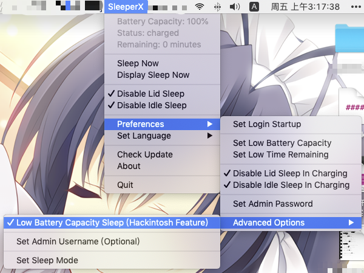

# SleeperX

Auto sleep on low battery capacity. (Hackintosh Feature)

Auto disable sleep on use AC power.

And it can disable idle sleep or lid sleep!



## How To Build

* Install Requirement.

```bash
pip3 install rumps pyinstaller requests pyexecjs zhconv
```

* Build

```bash
python3 build.py
```

## Report Bug

If you meet some bug in this app, You can try to export log (in "Preferences" - "Advanced Options"), and send to this project issues page.

It will be export log file to directory, your private data will replace with hider text.

And the next step, you can send this log file on this project' s GitHub page issues.
