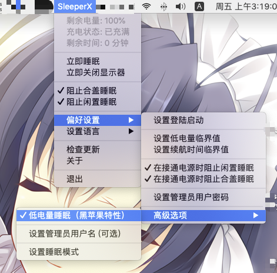

# SleeperX

在低电量时自动睡眠。（Hackintosh特性）

在接通电源时，可以自动禁止睡眠。

并且可以随意关闭闲置睡眠或合盖睡眠。



## 如何构建

* 安装依赖包

```bash
pip3 install rumps pyinstaller requests
```

* 构建

```bash
python3 build.py
```


## 提交Bug

如果你在这个应用遇到问题，您可以尝试导出日志（在“偏好设置”-“高级选项”），并发送到这个项目的 issues 页面。

这将会导出日志文件到目录，你的隐私数据将会被屏蔽文字所替换。

下一步，你可以将这个日志文件发送到这个项目的GitHub页面的issues。
